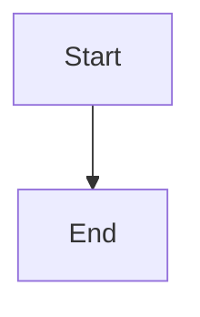
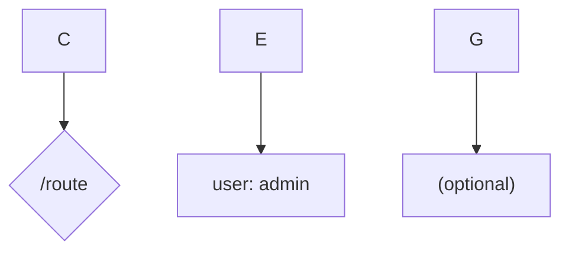
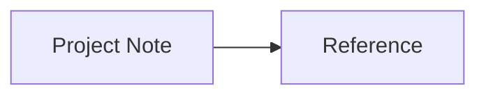
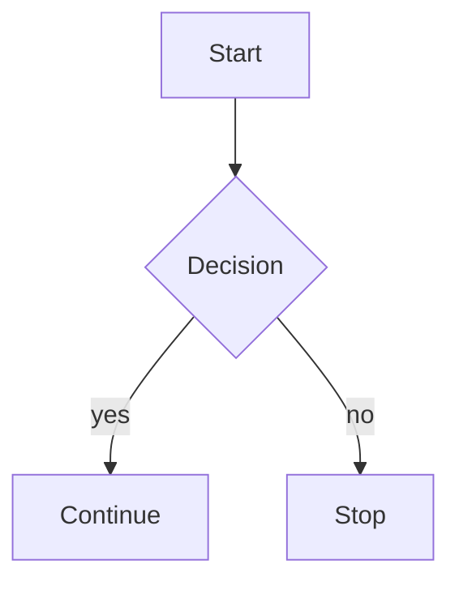
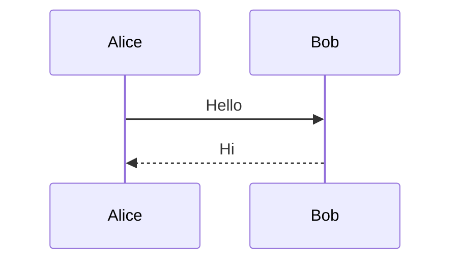
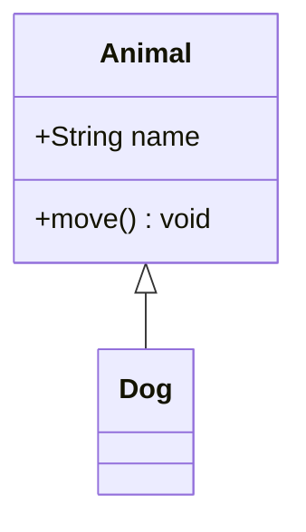
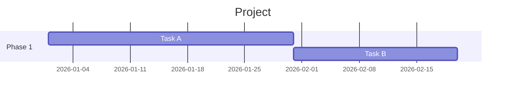

# Mermaid

Mermaid is a text-based diagramming language that Obsidian renders natively inside fenced code blocks with the `mermaid` language tag. Obsidian desktop v1.4.0+ bundles Mermaid v10.x; mobile tracks shortly behind.

## Fence syntax

````markdown

````

The opening fence must be ` ```mermaid ` and the diagram body must begin with a diagram-type keyword on the first non-blank line.

## Supported diagram types (Obsidian Mermaid v10.x)

| Keyword | Purpose |
|---|---|
| `flowchart` / `graph` | General node-and-edge diagrams |
| `sequenceDiagram` | Actor interactions over time |
| `classDiagram` | UML-style class relationships |
| `stateDiagram` / `stateDiagram-v2` | Finite state machines |
| `erDiagram` | Entity-relationship |
| `journey` | User journey |
| `gantt` | Project timelines |
| `pie` | Pie charts |
| `gitGraph` | Git branch history |
| `mindmap` | Hierarchical mind maps |
| `timeline` | Temporal events |
| `quadrantChart` | 2x2 quadrant plots |
| `requirementDiagram` | Requirements modeling |
| `C4Context` / `C4Container` / `C4Component` / `C4Dynamic` / `C4Deployment` | C4 model |

Mermaid v11 shapes (lean-right, notched pentagon, etc.) and beta diagrams (`sankey-beta`, `xychart-beta`, `block-beta`, `packet-beta`, `architecture-beta`) may not render in Obsidian until its bundled Mermaid is upgraded.

## Flowchart shape reference

| Syntax | Shape |
|---|---|
| `A[Text]` | Rectangle |
| `A(Text)` | Rounded rectangle |
| `A((Text))` | Circle |
| `A{Text}` | Diamond (decision) |
| `A{{Text}}` | Hexagon |
| `A[[Text]]` | Subroutine |
| `A[(Text)]` | Cylinder |
| `A>Text]` | Asymmetric |
| `A[/Text/]` | Parallelogram |
| `A[\Text\]` | Parallelogram alt |

## Special characters that break syntax

Unquoted `/`, `#`, `:`, `(`, `)`, `[`, `]`, `{`, `}`, `"`, and `|` inside a node label will crash the Mermaid lexer with:

```
Error parsing Mermaid diagram!
Lexical error on line N. Unrecognized text.
```

**Fix:** wrap the label in double quotes.



Alternatively, use HTML entity codes inside labels: `#35;` for `#`, `#40;` for `(`, etc. See [Mermaid special characters docs](https://mermaid.js.org/syntax/flowchart.html#special-characters-that-break-syntax).

## Obsidian-specific integration

### Clickable internal links via `internal-link` class

Assign the `internal-link` CSS class to make a node behave like a wikilink:



The node text must match the target note's filename (case-sensitive, path-sensitive). Notes in the vault root can be finicky — prefer notes in folders.

### Wikilinks inside labels

Recent Obsidian versions render `[[NoteName]]` inside node labels, but escaping varies by diagram type. When unsure, fall back to the `internal-link` class pattern above.

## Common errors and fixes

| Error | Likely cause | Fix |
|---|---|---|
| `Lexical error on line N. Unrecognized text.` | Unquoted special char in label | Wrap label in `"..."` |
| `No diagram type detected for text: ...` | First line is not a recognized keyword | Start with `flowchart TD`, `sequenceDiagram`, etc. |
| `Parse error on line N: Expecting ...` | Unbalanced brackets/braces or arrow typo | Check `[]`/`{}`/`()` pairs and arrow syntax (`-->`, `-.->`, `==>`) |
| Diagram renders blank | Obsidian's bundled Mermaid is older than the feature used | Check Obsidian version; avoid v11-only shapes |

## Minimal valid examples

### Flowchart



### Sequence



### Class



### Gantt



## References

- [Mermaid Syntax Reference](https://mermaid.js.org/intro/syntax-reference.html)
- [Mermaid Flowchart Syntax](https://mermaid.js.org/syntax/flowchart.html)
- [Obsidian Advanced Syntax](https://obsidian.md/help/advanced-syntax)
- [Obsidian forum: internal-link class in Mermaid](https://forum.obsidian.md/t/hassle-free-linking-in-mermaid-graphs/6983)
- [Obsidian forum: supported diagram types](https://forum.obsidian.md/t/is-there-a-list-of-supported-mermaid-diagram-types-anywhere/62721)
